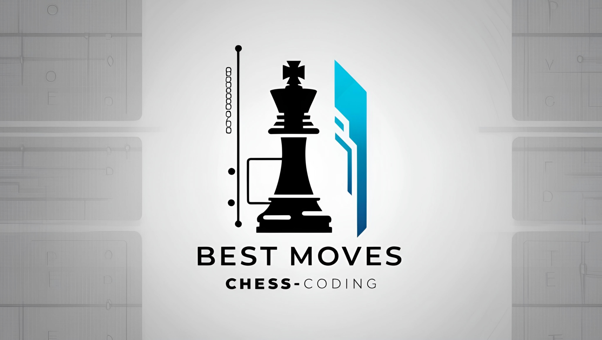

# Chess Position Evaluator (Cross-Platform Maia Edition)

<p align="center">
  
</p>

## What’s Changed & Why

* **Maia Integration**

  * Stockfish replaced with the human-like Maia engine (`lc0` + `maia-*.pb.gz` weights).
  * Maia’s suggestions mimic a \~1600 Elo human, reducing cheat flags on sites like Chess.com.

* **Visits Slider**

  * Renamed **"Maia Visits"** to control Monte‑Carlo Tree Search visits (default **100**, range 10–500).

* **Cross-Platform Input Support**

  * **Windows**: native Win32 API (`win32api`/`win32con`) for click-click controls.
  * **Wayland**: uses `grim` for screenshots and `input_capture.WaylandInput` for clicks.
  * **X11/Linux**: falls back to `mss` screenshots and `pyautogui` for cursor movement & clicks.

* **Roblox 2D Chess Club**

  * Adapted to click-click (no drag) for compatibility with Roblox’s 2D input model.

## Installation & Setup

1. **Clone the Repository**

   ```bash
   git clone --branch maia-support --single-branch https://github.com/OTAKUWeBer/ChessPilot.git
   cd ChessPilot
   ```

3. **Install Python Dependencies**

   ```bash
   pip install -r requirements.txt
   ```

4. **Board Detection Model**

   * Download `chess_detection.onnx` from:
     [https://github.com/Zai-Kun/2d-chess-pieces-detection/releases/latest](https://github.com/Zai-Kun/2d-chess-pieces-detection/releases/latest)
   * Rename to `chess_detection.onnx` and place alongside `main.py`.

5. **LCZero (lc0)**

   * Download the Windows binary (or Linux) from:
     [https://github.com/LeelaChessZero/lc0/releases](https://github.com/LeelaChessZero/lc0/releases)
   * Place `lc0.exe` (Windows) or `lc0` (Linux) in the project root.

6. **Maia Weights**

   * Download `maia-1600.pb.gz` from:
     [https://github.com/CSSLab/maia-chess/releases/latest](https://github.com/CSSLab/maia-chess/releases/latest)
   * Create a folder `models/` next to `main.py` and add the weights.

7. **Wayland Support (Linux)**

   * Install `grim` for screenshots: e.g. `sudo pacman -S grim`.
   * Ensure `input_capture` module is available in your PYTHONPATH.

8. **Run the App**

   ```bash
   python main.py
   ```

## Usage

1. Choose **White** or **Black** in the GUI.
2. Adjust **Maia Visits** slider (10–500).
3. **Play Next Move**:

   * Manual: click **Play Next Move**.
   * Auto: enable **Auto Play Moves**.
4. Tick **Kingside/Queenside** for castling rights as needed.
5. Press **ESC** to reset color selection.

## Branch Workflow

To keep Maia work separate from `main`:

```bash
# Ensure on main
git checkout main
# Create feature branch
git checkout -b maia-support
# Commit and push
git push -u origin maia-support
```

Continue committing on `maia-support` without merging into `main`.

## Conversational Context

* **Chess.com**: Maia’s human‑like mistakes reduce cheating flags.
* **Roblox Chess Club**: Win32 click‑click ensures reliable piece movement.

## Disclaimer

🛑 **Use at Your Own Risk**: Even human-like engines may violate ToS on some platforms.

## License & Contributing

* **MIT License**.
* Contributions welcome for additional Maia levels, input support, or new platforms.

Enjoy realistic, cross-platform chess automation! 🎉
